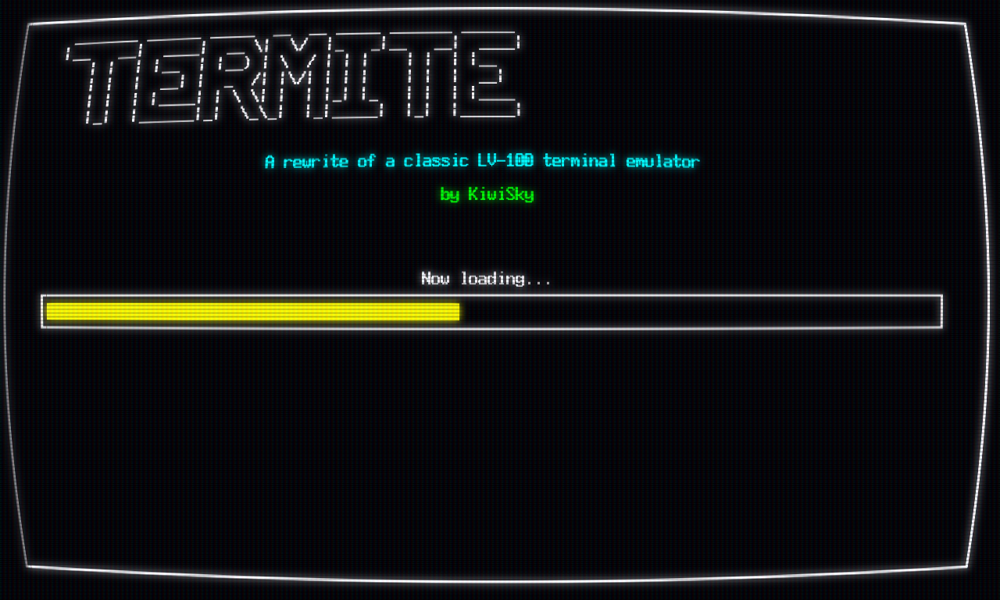

# Termite
A rewrite of original [LV-100](https://github.com/Eiyeron/LV-100/tree/master?tab=readme-ov-file) terminal emulator for Love2D



---
The focus of this library is to rewrite the original LV-100 library in a modern and expansible way, fixing the old bugs and adding new features.

The syntax tries to resemble the original but with some minor differences.

> [!IMPORTANT]
> The documentation of the library still in WIP, open a PR if you want suggest new features, contribute with documentation or add examples.

```lua
function love.load()
    terminal = require 'termite'
    moonshine = require 'moonshine'

    screen = moonshine(moonshine.effects.crt)
    --.chain(moonshine.effects.vignette)
    .chain(moonshine.effects.glow)

    screen.glow.min_luma = 0.2
    ctrframe = love.graphics.newImage("assets/perfect_crt_noframe.png")

    local termfont = love.graphics.newFont("assets/toshibasat.ttf", 24)

    term = terminal.new(love.graphics.getWidth(), love.graphics.getHeight() - termfont:getHeight(), termfont, nil, nil)
    term.speed = 5000

    love.keyboard.setKeyRepeat(true)

    term:setCursorVisible(false)
    term:blit([[
      _______ ______ _____  __  __ _____ _______ ______ 
     |__   __|  ____|  __ \|  \/  |_   _|__   __|  ____|
        | |  | |__  | |__) | \  / | | |    | |  | |__   
        | |  |  __| |  _  /| |\/| | | |    | |  |  __|  
        | |  | |____| | \ \| |  | |_| |_   | |  | |____ 
        |_|  |______|_|  \_\_|  |_|_____|  |_|  |______|
    ]], 1, 2)

    term:frame("line", 1, 1, term.width, term.height)
    term:setCursorColor("brightCyan")
    term:print(2, 10, string.justify("A rewrite of a classic LV-100 terminal emulator", term.width - 4, " ", "center"))
    term:setCursorColor("brightGreen")
    term:print(2, 12, string.justify("by KiwiSky", term.width - 4, " ", "center"))
    term:setCursorColor("white")
end

function love.draw()
    screen(function()
        do
            local scale = 1
            local sx, sy = (love.graphics.getWidth() / term.canvas:getWidth()) * scale, (love.graphics.getHeight() / term.canvas:getHeight()) * scale
            love.graphics.push()
                love.graphics.translate((love.graphics.getWidth() * (1 - scale)) / 2, (love.graphics.getHeight() * (1 - scale)) / 2)
                love.graphics.scale(sx, sy)
                term:draw()
            love.graphics.pop()
        end
        love.graphics.setColor(0.3, 0, 0)
    end)
    love.graphics.draw(ctrframe, 0, 0, 0, love.graphics.getWidth() / ctrframe:getWidth(), love.graphics.getHeight() / ctrframe:getHeight())
end

function love.update(elapsed)
    term:update(elapsed)
end
```

## Attributions

[int10h.org | Great library of oldschool pc fonts](https://int10h.org/)
[LV-100 by Eiyeron](https://github.com/Eiyeron/LV-100/tree/master?tab=readme-ov-file)
[Moonshine by VRLD](https://github.com/vrld/moonshine)